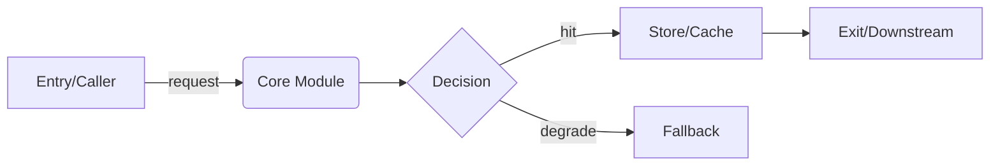

# Tech Design

## Purpose

Turn a fuzzy requirement into a **minimal, precise technical design** that two audiences can act on:

- **Review engineers** — must understand and approve the design fast.
- **code-gen (code-architect)** — consumes this design as its Plan input, then writes code.

A tech design answers **what problem, which features, what logic, what structure** — not "what is the exact method signature" or "what columns does the table have". Those contracts are code-gen's job. Keep every line informing a build or a review decision; prefer diagrams, tables, and tight logic statements over prose.

## Core Principles

1. **整体到局部，从上到下 (Top-down, macro→micro).** Lead with the overall structure and end-to-end flow, then drill into modules, then into the key logic inside each module. A reviewer reading only the top should already grasp the whole approach.
2. **功能点必须齐全 (Enumerate all features).** List every feature/behavior this design covers — including edge behaviors, error paths, and non-goals. Completeness of the feature set is a first-class deliverable; a missing feature point is a design defect.
3. **定义问题与逻辑，不定义实现细节 (Define the problem & logic, not the low-level contract).** State the problem, the features, the module responsibilities, the data that flows and how it flows. Do **not** write interface signatures, DTO fields, table DDL, index lists, Redis key/TTL — hand those to code-gen. If a data concept matters, describe it conceptually ("需要一份用户风控画像，含等级与最近命中时间"), not as a schema.
4. **方案必须确定 (Commit to a decision).** No "待定 / 二选一 later". If something truly cannot be decided, mark why, when it will be decided, and its impact. Selection tables may compare options, but the **conclusion is always chosen**.

## Workflow (Clarify → Reflect → Draft → Confirm)

### Step 1 — Clarify goal, features & constraints

Do NOT start writing the design immediately. First lock down, asking only for what is missing (max 5 questions):

- **功能目标**: what exactly is being built, and the one success criterion.
- **功能点范围**: the full list of features/behaviors expected — probe for the ones the user likely forgot.
- **上下文约束**: current stack, existing modules/services, data sources, hard limits (latency, QPS, deadline, team).
- **边界**: what is explicitly out of scope (non-goals).
- **触发/数据流**: who calls it, what comes in, what goes out.

If the user says "just draft it" or context is thin, proceed with explicit **假设 (assumptions)** clearly marked, and continue.

### Step 2 — Reflect (challenge the request)

The user's stated goal/features may be wrong, incomplete, or over-scoped. Before drafting, output a short `<reflection>` that checks:

- Is the stated goal the *real* goal, or a solution in disguise? Is there a simpler path to the same outcome?
- **Are all feature points covered?** Which behaviors did the user forget (idempotency, concurrency, failure/rollback, observability, data consistency, empty/limit/error paths)?
- Over-engineering: any feature/component that can be cut without hurting the goal.
- Wrong assumptions or hidden risks.

If you find a problem, say so directly and propose the correction. Do not silently comply.

### Step 3 — Draft ONE design and STOP

Produce the design using the Output Format below, then **STOP and wait for review**. Do NOT proceed to code-gen or expand into more docs until the user replies "同意 / confirm / 继续" or equivalent.

- **Consistency on change (align immediately)**: a single decision usually surfaces in multiple places (interface signatures, diagrams, logic descriptions, constraint/assumption tables). Whenever a decision changes, **re-scan and sync all its other occurrences on the spot** so they describe the same fact — never defer this to a final verification pass. For multi-role / multi-component systems, explicitly check that diagrams, interfaces, and logic descriptions all point to the same thing.

### Step 4 — Handoff

On approval, the design is ready to feed into `code-gen` (code-architect) as its Plan input. code-gen is responsible for turning the feature set + logic + structure into concrete interfaces, data structures, and table schemas. Offer to trigger it.

## Output Format

Keep it dense and top-down. Drop any section that adds nothing for this task.

### Document organization (layered by complexity)
- **Simple / single-module design**: use the single-doc template below; do not over-split.
- **Complex / multi-module / multi-role system**: upgrade to a **two-part structure within ONE document** —
  - **Part 1 — Solution Design (for reviewers, what & why)** — arranged in pyramid structure: conclusion first, supporting rationale second, details last.
    1. Goal & background
    2. Concept glossary
    3. Feature list
    4. Business architecture diagram (role view)
    5. Business flow diagram
    6. Constraints & assumptions
    7. Option selection + Build vs Buy
    8. Technical feasibility verification
    - **Feature list writing rule**: each item describes a **capability** — what pain it solves, what it enables. **Do NOT** include stage/phase numbers (Stage 1/2/3…), execution-step arrows (→), or implementation-level technology names (specific platforms/tools). Sequencing and phase definitions belong in flow diagrams and sequence diagrams only, not in the feature list.
    - **Self-explanatory diagrams**: annotate architecture/flow diagrams with brief notes for key constraints that affect structure (e.g. label a node with "no batch API → shard & poll"). This lets diagrams be understood without reading ahead to the constraints section.
  - **Part 2 — Technical Implementation Design (for code-gen, how)**: implementation architecture diagram, module breakdown (responsibility/boundary/deps), key-flow sequence diagrams, inter-module interfaces, data structures & DDL, implementation-level risks.
  - **Seam: a module ↔ feature/assumption mapping table** (at the start of Part 2) — each module notes which Part-1 features it implements and which assumptions it depends on.
- **Why two parts in one file, not two files**: when design and implementation evolve under the **same author and same review cycle** (tightly coupled, changed together), splitting into two physical files makes it easy to change the implementation and forget to update the upstream assumption, silently rotting the design doc. One file + the mapping table keeps the dependency physically visible and makes backflow explicit and cheap. Only split into separate files when implementation is handed to an **independent team and the design is frozen**.
- **Backflow rule**: if implementation disproves a Part-1 assumption or feature (e.g. "that platform actually has no API"), follow the mapping table to locate and fix the Part-1 entry — pure "how" changes do not backflow, but changes to "what/why" must.

```markdown
## 技术方案: <name>

### 1. 问题与目标 (Problem & Goal)
- 要解决的问题（不是"做什么功能"，而是"解决什么问题"）。
- 一句话目标 + 唯一成功判据（可度量）。
- 非目标 (Non-goals): 明确不做什么。

### 2. 功能点清单 (Feature List) — REQUIRED
逐条列出本次覆盖的全部功能点/行为，含正常路径与异常/边界行为。每条只写**能力**（解决什么痛点、赋予什么能力），禁止混入阶段编号、执行步骤箭头、技术手段名词。此清单必须齐全。
| # | 功能点 | 说明 / 触发条件 | 归属模块 |
|---|--------|----------------|----------|
| 1 | ... | ... | ... |

### 3. 整体结构与链路图 (Overall Structure & Flow) — REQUIRED
先讲整体：1-2 段说清"整体怎么组织、数据从哪来、经过谁、到哪去"。
- **链路图 (mandatory)**: 用 Mermaid `flowchart` 画端到端主链路，从入口到出口。标注每个节点(服务/模块)、每条边上的协议/数据、以及关键分支/失败/降级路径。
- **角色-职责图 (multi-role systems, mandatory)**: 当系统涉及多个使用角色时，除链路图外，补一张按"角色 × 阶段 × 动作"的泳道图（Mermaid `flowchart` 分 subgraph 或 `sequenceDiagram`），让评审看清"谁在什么环节做什么、用哪个组件"。链路图回答"系统怎么建"（给 code-gen），角色图回答"谁用、怎么用"（给评审和使用者）。
- **图自解释**: 图中用简短注释标注影响结构的关键约束（如节点旁标"无批量接口→分片提交"），让图不依赖后文约束表即可读懂。
- 复杂或有状态时补 `sequenceDiagram` / `stateDiagram`。
- 图中必须体现: 上下游、存储、缓存、MQ、第三方依赖（用概念名，不写表名/字段）。



### 4. 约束与假设 (Constraints & Assumptions)
| 类型 | 内容 |
|------|------|
| 技术栈 | ... |
| 约束 | 延迟/QPS/数据规模/依赖/deadline |
| 假设 | 标记为假设，待确认 |

### 5. 方案选型 (Options) — only if >1 viable path
| 方案 | 优点 | 缺点 | 适用条件 |
|------|------|------|----------|
| A(选定) | ... | ... | ... |
| B | ... | ... | ... |
> 选 A 的理由: 一句话。结论必须确定。

### 6. 模块设计与实现逻辑 (Modules & Logic) — from macro to micro
按模块展开，每个模块只写：
- **职责**: 一句话说明该模块做什么、边界在哪。
- **需要的数据**: 概念层面说明输入/输出/依赖的数据（"用户等级、最近命中时间"），不写字段类型/表结构。
- **关键逻辑**: 只写关键路径与决策点——幂等、并发、一致性、失败与回滚、降级。写清判断条件，不写流水账，不写接口签名。

### 7. 风险与待确认 (Risks & Open Questions)
- 非平凡项目此处不得为空。
- 上线/观测/兼容性等需要关注但本方案未细化的点，在此点名（细化留待落地阶段）。

---
**等待评审确认后再进入 code-gen。**
```

## Rules

1. **Top-down (pyramid)**: conclusion first (goal → features → architecture diagram), then supporting rationale (constraints, options), then details. A reviewer reading sections 1–3 should already have the full mental model.
2. **Feature list must be complete**: enumerating all feature points (§3) is mandatory; a forgotten behavior is a design bug, not a code-gen bug.
3. **No low-level contracts**: do NOT write interface signatures, DTO/field definitions, table DDL, indexes, or Redis key/TTL. Describe data conceptually and let code-gen produce the precise contract.
4. **One design at a time**: never dump multiple full alternatives as finished designs — compare in the Options table, commit to one.
5. **Make non-goals explicit** to stop scope creep.
6. **Commit to decisions**: no "待定"/二选一 unless justified with reason + when-decided + impact.
7. **Mark every assumption** as an assumption; never hide uncertainty.
8. **Explain trade-offs, not just the choice** (one line each is enough).
9. **Reflect before drafting** — challenging a wrong requirement and catching missing features is the highest-value thing this skill does.
10. **Follow the user's language** (Chinese request → Chinese design).
11. **Design only** — do not write implementation code, interfaces, or schemas; that is code-gen's job.
12. **Feature list ≠ flow** — the feature list answers "what can the system do" (capability view); flow diagrams/sequence diagrams answer "how do things run in order" (process view). Never mix them: no phase numbers, step arrows, or implementation-level tool names in the feature list.

## Checklist (Internal)

- [ ] Problem stated (the real problem, not a feature list in disguise)
- [ ] Goal + single success criterion stated
- [ ] Non-goals explicit
- [ ] `<reflection>` challenged the request AND checked feature completeness before drafting
- [ ] Feature list (§3) enumerates ALL feature points, including error/edge behaviors
- [ ] Feature list items are capability descriptions only — no phase numbers, step arrows, or tech-tool names
- [ ] Assumptions marked
- [ ] Reasoning is top-down: overall structure & flow before module logic
- [ ] End-to-end flow diagram (Mermaid flowchart) included, showing nodes/edges/failure paths (conceptual, no table/field names)
- [ ] Module logic covers idempotency / concurrency / failure / rollback where relevant
- [ ] NO interface signatures / table DDL / field-level schema present (deferred to code-gen)
- [ ] Options compared only when >1 viable path; a conclusion is committed
- [ ] Stopped and awaited review before handoff
